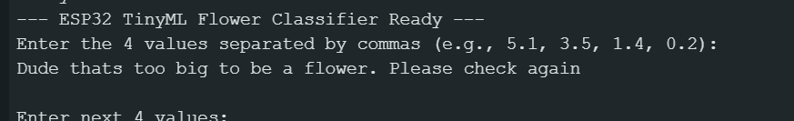

#  TinyML Iris Flower Classifier on ESP32

An ultra-lightweight, edge-computing Machine Learning application that identifies three species of Iris flowers locally on an ESP32 microcontroller. By leveraging an optimized Random Forest ensemble classifier, the system achieves an incredibly low inference execution footprint with built-in data validation guardrails.

---

##  Key Architectural Highlights

* **Pure Edge Execution:** No cloud dependencies, internet connection, or external API hooks required. Inference runs entirely offline on-chip.
* **Microsecond Latency:** Optimized C++ tree structures execute in **~5 to 60 microseconds** depending on execution depth.
* **Input Validation Guardrails:** Implements an "Out of Distribution" (OOD) software gateway to reject invalid or garbage inputs (e.g., `0,0,0,0`) safely before passing data to the model.

---

##  The Iris Dataset & Input Structure

The underlying classifier relies on the historic botanic dataset mapping 4 distinct morphology metrics across 3 unique species profiles:

### Target Features (Inputs)
1. **Sepal Length** (cm)
2. **Sepal Width** (cm)
3. **Petal Length** (cm)
4. **Petal Width** (cm)

### Predicted Classes (Outputs)
* `Iris Setosa` (Class 1)
* `Iris Versicolor` (Class 2)
* `Iris Virginica` (Class 3)

---

##  Hardware & Environment Requirements

* **Microcontroller:** ESP32 (Any standard Dev Module variant)
* **Development IDE:** Arduino IDE v2.x or later
* **Baud Rate Configuration:** `115200`
* **Python Framework (For training regeneration):** `scikit-learn` & `everywhereml`

---
## Commands to Run:
Check the requirements first:
```bash
pip install --upgrade pip
pip install scikit-learn everywhereml
```
---
## How to Use This Repository

To get this project running on your hardware, clone the repository using 
```bash
`git clone https://github.com/shenoyshre22/ESP32-TinyML-Iris-Classifier.git`
```
 and open `iris_flwr.ino` inside the Arduino IDE. Ensure your `model.h` file remains in the same directory before flashing the code over to your connected ESP32 board. Once uploaded, launch your Serial Monitor at **115200 baud** to input test measurements. 
 However , If you want to experiment, modify, or retrain the underlying Random Forest model yourself, simply upload the `Iris_flwr_dataset.ipynb` file straight into Google Colab, connect it to the standard dataset, and run the Python cells to auto-generate a brand new C++ model array.
---
##  File Directory Mapping

```text
├── iris_flwr.ino      # Main executable Arduino program wrapper (handles Serial I/O & logic)
└── model.h            # Patched C++ optimized blueprint array of the trained machine learning model
└── Iris_flwr_dataset.ipynb #the python file which runs on google colab
```
---
## What the Output looks like

Standard output when the random example values entered in the above strip were:
5.1828 , 3.6767, 9.888,0.1999


When absurd values like 0,0,0,0 is entered the output is :


Also some values like 90,889,102,67 the output is:
